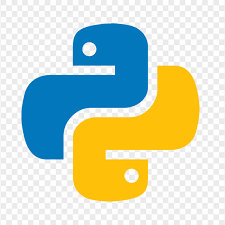
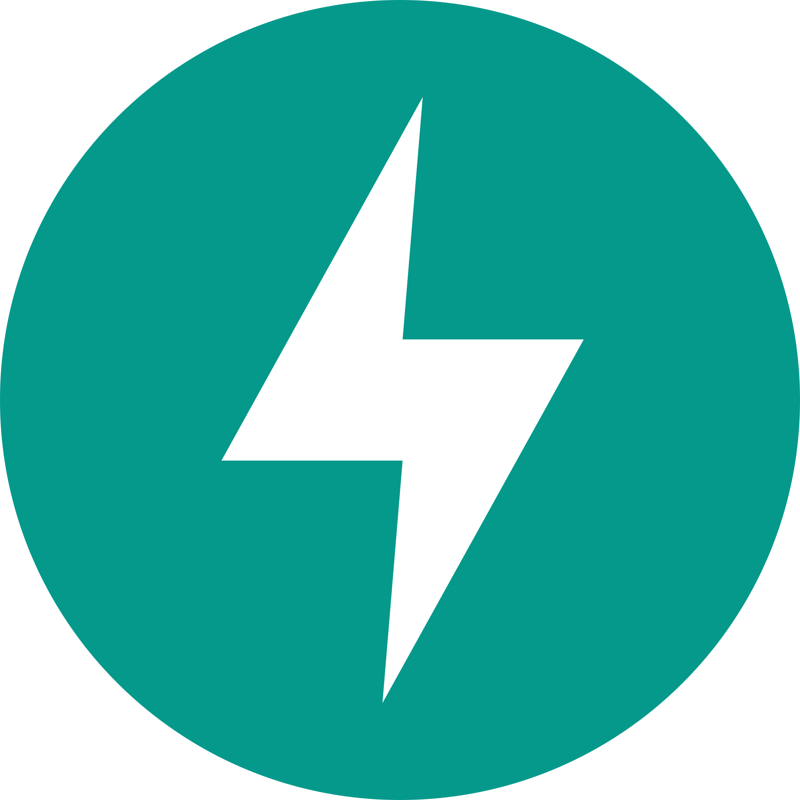

<h1 align="center">Hi 👋, I'm Muhammad Bilal</h1>
<h3 align="center">Compiling my code... Please wait! 👀</h3>

  

  
  
  

---

- 🔭 I’m currently working on **AI/ML projects, LangChain, LangGraph, Crewai, Agentic AI, Chatbots, RAGs**  
- 👨‍💻 All of my projects are available at [My GitHub Projects](https://github.com/MuhammadBilal018?tab=projects)  
- 📫 How to reach me: **chbilalakram222@gmail.com**  
- ⚡ Fun fact: **I think I am funny 😁**

---

## Connect with me

  

  

---

## Languages & Tools

  
  
  
  
  
  
  
  
  

  
  
  
  
  
  
  
  

---

## GitHub Analytics

  
  

---

